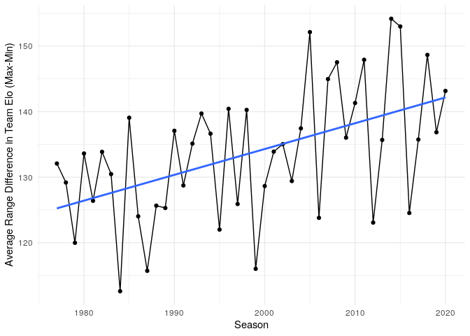
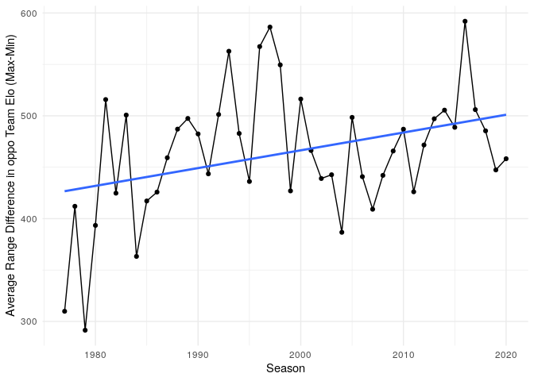

Retrospective strength of schedule in the NBA (shiny app)
================

[Link to shiny app](https://georgeblck.shinyapps.io/oppoElo/)

During the regular season a common measure of a teams remaining strength
of schedule (SOS) is the combined winning percentage of those opponents
[(Example)](http://www.tankathon.com/remaining_schedule_strength). A
high winning percentage means the opponents you still have to face are
probably tough and vice-versa.

There are two ideas I want to apply in this work that are in a similar
vein:

1.  Substitute the winning percentage with a more adequate measure of
    performance: the Elo score.
2.  Instead of a *remaining* SOS, calculate a *retrospective* SOS.

The first addition is self explanatory and through 538s work very easy
to implement. The latter idea

## Data

  - All games since 1977 season (NBA/ABA Merger)
  - All taken from 538s Elo database.
    [link](https://projects.fivethirtyeight.com/nba-model/nba_elo.csv)

## Results

### Variation in Opponents Elo

The variation in Opponents Elo is a lot smaller than the general Team
Elo (i.e. the strength of teams and not their opponents). That is to be
expected as the strength of a team can only vary so much through a
season. The highest amount of variation occurs in the 1999 season. As
far as I can tell the reason is the strength of the westen conference.

<!-- --><!-- -->

### Intra-Season Variation in Elo and oppoElo

Let us now look on the highest deviations in terms of Elo in the past
NBA.

We see that the 2011 Cavs had the highest difference in their own team
Elo. This is due to Lebron James leaving during the offseason of 2010
and subsequent skill loss. The same thing happened to Chicago in 1999
after Michael Jordans second retirement. The opposite happened to the
2008 Boston Celtics: Pierce, Allen & Garnett got them the championsip.

So we see, that big changes in a teams Elo through a season are mainly
due to player movements.

<!-- -->

Now if we look at variation in opponents team Elo there is not such a
clear picture. Portland faced both the Warriors at their Elo apex and
the pre-processed 76ers in 2016. Most of the other outliers are due to
the GSW or Michael Jordan.

<!-- -->

### Increased variation in seasonal performance

There actually seems to be an increase in seasonal variation per team
elo.

<!-- --><!-- -->

## To-Do

  - [x] Upload shiny to shinyapps.io
  - [ ] Add more seasons (by solving conferences, use elo website )
  - [x] Add carmElo for the recent seasons (via button)
  - [x] Make the graphic bigger in browser
  - [x] Look into the max/min delta a team can undergo in a season
  - [x] Visualize the variation in oppoElo and teamElo
  - [x] Make multiple seasons selectable
  - [ ] Replace team names if it’s only name change
  - [ ] How similar are the different Elo scores (logreg and visual)
