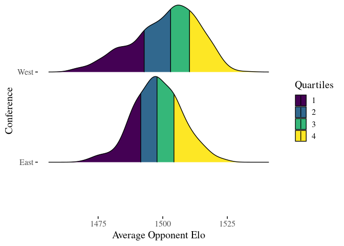
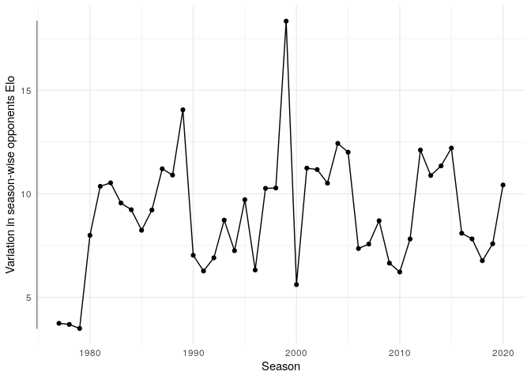
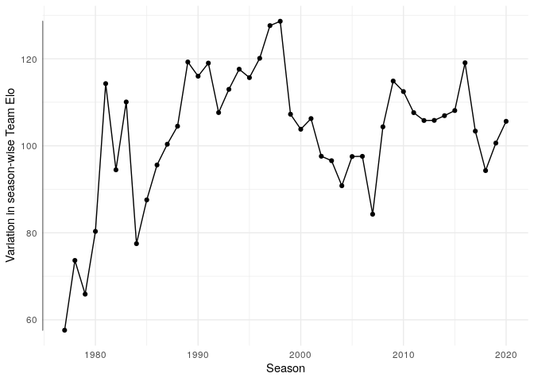
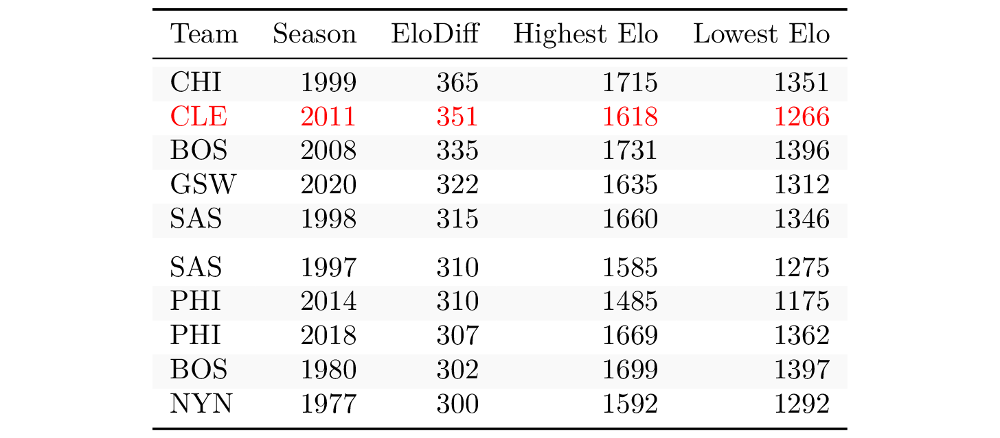
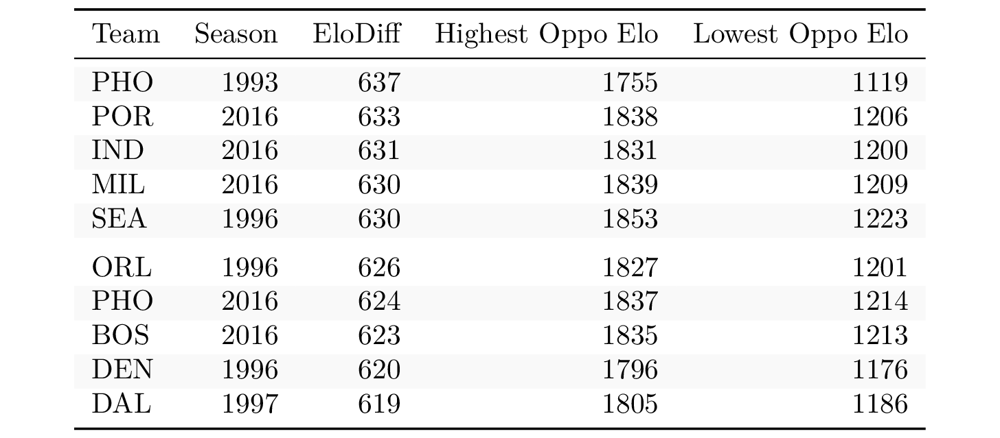
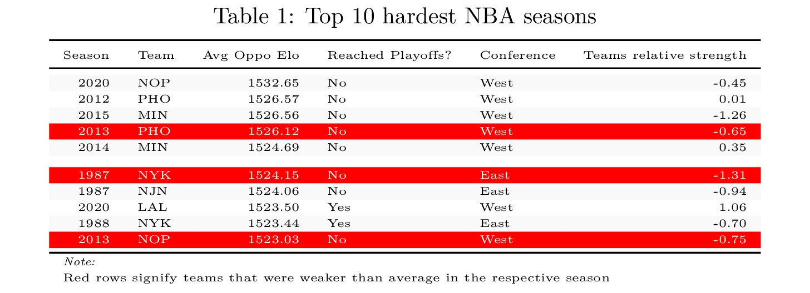
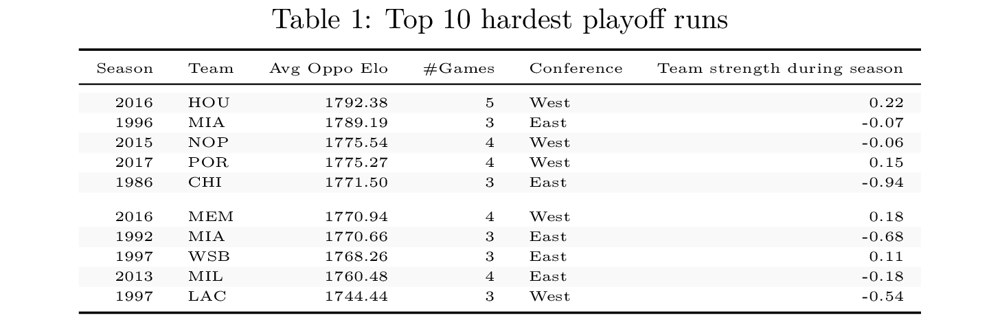
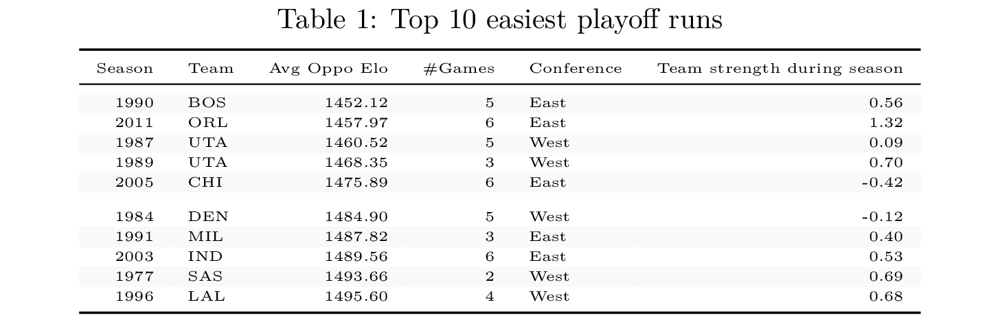

Retrospective strength of schedule in the NBA (shiny app)
================

[Link to shiny app](https://georgeblck.shinyapps.io/oppoElo/)

During the regular season a common measure of a teams remaining strength
of schedule (SOS) is the combined winning percentage of those opponents
[(Example)](http://www.tankathon.com/remaining_schedule_strength). A
high winning percentage means the opponents you still have to face are
probably tough and vice-versa.

There are two ideas I want to apply in this work that are in a similar
vein:

1.  Substitute the winning percentage with a more adequate measure of
    performance: the Elo score.
2.  Instead of a *remaining* SOS, calculate a *retrospective* SOS.

The first addition is self explanatory and through 538s great work very
easy to implement. The latter idea stems from my interest in questions
like

-   Who had the hardest or easiest season in 2019?
-   Who had the hardest or easiest season *ever*?
-   Who had the hardest playoff run ever?

All of these results depend on there being some amount of variation in
opponents team strength (measured via elo). This is why it is important
to first look at this variation.

Results
-------

<!-- --><!-- -->

### Variation in Opponents Elo

The variation in Opponents Elo is a lot smaller than the general Team
Elo (i.e. the strength of teams and not their opponents). That is to be
expected as the strength of a team can only vary so much through a
season. The highest amount of variation occurs in the 1999 season. As
far as I can tell the reason is the strength of the westen conference.

<!-- --><!-- -->

### Intra-Season Variation in Elo and oppoElo

Let us now look on the highest deviations in terms of Elo in the past
NBA throught a single season.

We see that the 2011 Cavs had the highest difference in their own team
Elo. This is due to Lebron James leaving during the offseason of 2010
and subsequent skill loss. The same thing happened to Chicago in 1999
after Michael Jordans second retirement. The opposite happened to the
2008 Boston Celtics: Pierce, Allen & Garnett got them the championsip.

Summing up: Big changes in a teams Elo through a season are mainly due
to player movements.

Opponents Elo is not as informative: Portland faced both the Warriors at
their Elo apex and the pre-processed 76ers in 2016. Most of the other
outliers are due to either GSW or Michael Jordan.

### Who had the hardest season/playoff run?

The same for playoff runs

### Increased variation in seasonal performance

There seems to be an increase in seasonal variation per team elo.

<!-- --><!-- -->

Data
----

-   All games since 1977 season (NBA/ABA Merger)
-   All taken from 538s Elo database.
    [link](https://projects.fivethirtyeight.com/nba-model/nba_elo.csv)

Update Repo Oct 2020
--------------------

-   [x] Make better menu for choice of Raptor/Elo/Carmelo
-   [x] Make better menu for choice of season/playoff/both
-   [x] Subset data when Carmelo/Raptor is chosen
-   [x] Make legend much bigger
-   [x] Make other text bigger
-   [x] Make axis labels with “strength”
-   [ ] Write more explaining text?
-   [x] Add colour for won finals
-   [x] Update data but dont include 2020 season
-   [x] Add Champion tag to table

To-Do
-----

-   [x] Upload shiny to shinyapps.io
-   [x] Add more seasons (by solving conferences, use elo website ) (no)
-   [x] Add carmElo for the recent seasons (via button)
-   [x] Make the graphic bigger in browser
-   [x] Look into the max/min delta a team can undergo in a season
-   [x] Visualize the variation in oppoElo and teamElo
-   [x] Make multiple seasons selectable
-   [x] Replace team names if it’s only name change (via button)
-   [ ] How similar are the different Elo scores (logreg and visual)
-   [ ] Brush up text.
-   [x] Save table info so it shows up in github
-   [x] carmelo only when looking at single year? (no)
-   [x] Split by season –&gt; who had the hardest season/playoff
-   [x] Add table for searchable hardest/easiest season/playoff run with
    nice kable-highlights
-   [x] Table: Make oppoElo column fat
-   [x] Table: filters for double variables to integer or round
-   [x] Plot: Make labels bigger and change colour scheme to 538
-   [x] Think about doubling and possible problems
-   [x] Ridge plot for seasons West/East and over decades
-   [x] Add teams till 1970. Problem with ABA and conferences
